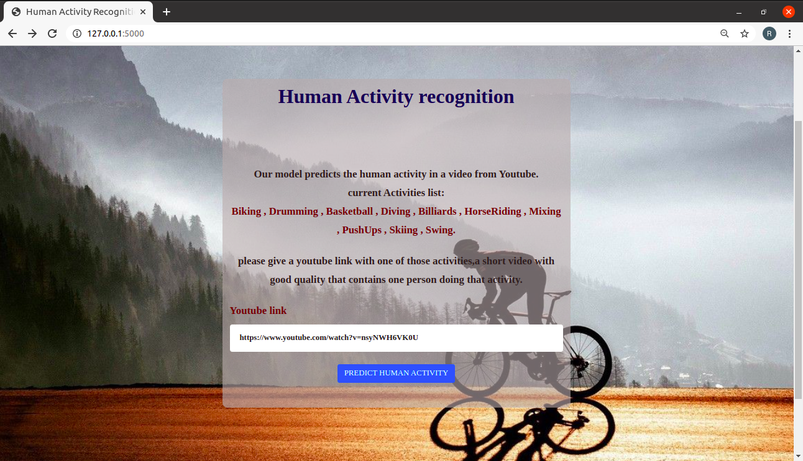
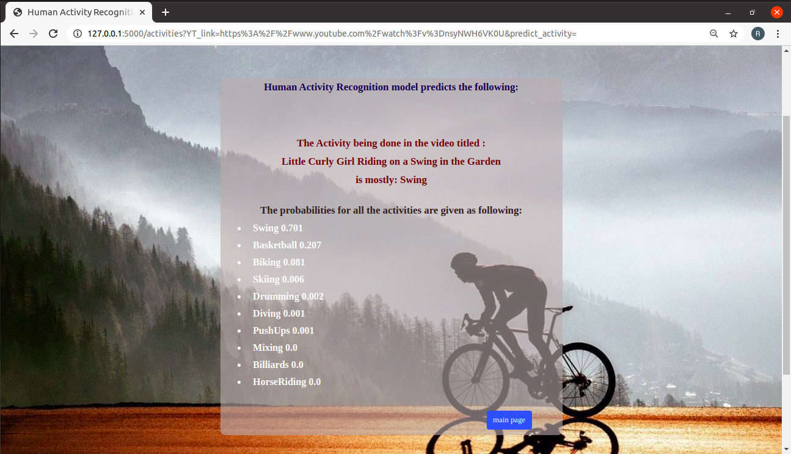

# Human-activity-recognition-video-classifier-

A model that predicts the activity being performed by a human in a video.

The Dataset used is the Youtube UCF50 – Action Recognition Dataset,I used only a part from the dataset with 10 actions:

Drumming - Biking - Basketball - Diving - Billiards - HorseRiding - Mixing - PushUps - Skiing - Swing

we tried with two models:

1- Model_1: Convolutional neural networks with pretrained model VGG16 (64*64*3)

2- Model_2: used the same previous model with Bidirectional LSTM.

only the first model provided in Github, the second model isn't , due to large size, please contact me if you want to get it.

### Usage:
you can use it with either terminal or web interface.
- clone the repository
- install the requirements.
- replace the model name(CNN or CNN_LSTM)
- for web interface, run python application.py in terminal, go to your browser and type: http://127.0.0.1:5000/
- insert a link to a youtube video which is short, good quality, for one person doing one of the ten activities .

after inserting the youtube link, click 'predict human activity' to get the predicted activity:

To use the terminal to get the predicted human activity with percentages, you have two options:
- python predict_CMD_YT_link.py <youtube link here>
- python predict_CMD_custom_vid.py <path to the video in your local disc>

To predict along with the video,or predict a video with more than one activity, you have the option:
- python  predict_video_frames.py <path to the video in your local disc>

